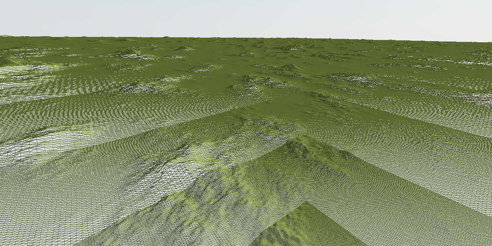

# Geo Clipmap

This project demonstrates a custom implementation of a technique for LOD-based terrain rendering called geometry clipmaps.

[Demo](https://tschie.github.io/geo-clipmap/) (may not be suitable for some devices)

### Geometry

The LOD regions are drawn with an instanced mesh so that each LOD shares the same simple plane geometry. The shader removes any overlapping vertices. This isn't optimal, but it's simpler than patching the terrain together with different geometries.

### Seams

Like most LOD-based terrain rendering techniques, geo clipmaps will show seams at the boundaries between different LODs. To fix this, I interpolate the heights at the boundaries in the shader.

### Center Offsets

LODs follow the camera by snapping their centers to the nearest position on their grid. Since LOD's have different resolutions, they move at different rates which can introduce a grid-cell-wide gap. To fix this, I add a one-cell border to each LOD. Then, in the shader, I keep the extra vertices that fill the gaps and hide any overlapping vertices.

## Usage

Fly the camera using WASD. Click and drag to point camera. As you fly around, the LOD regions move with the camera to show higher resolution terrain near the camera. 

Check the wireframe box to visualize the LODs. Uncheck to see that there are no seams between tiles.

Uncheck the update checkbox to unsync the camera from the terrain.

## Run Locally

1. Clone the repository.
2. In the root directory, run `npm install`.
3. Run `npm run dev`.
4. Open browser to localhost:3000/geo-clipmap.

## References

- https://mikejsavage.co.uk/blog/geometry-clipmaps.html (includes good visualizations of the technique and common problems)
